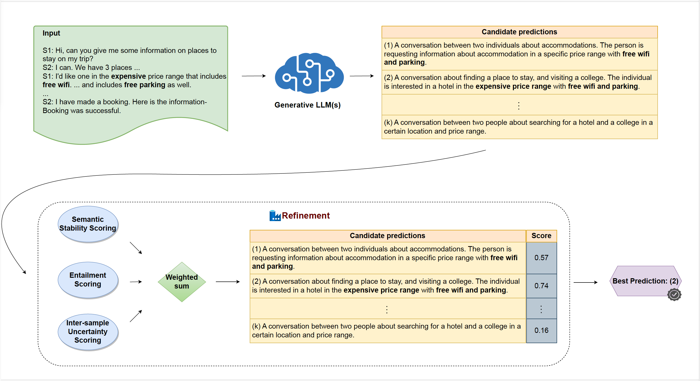

# CERET

Authors: Jason Cai, Hang Su, Monica Sunkara, Igor Shalyminov, Saab Mansour

**This is the code repository for paper CERET: Cost-Effective Extrinsic Refinement for Text Generation (NAACL 2024).**

CERET is a framework for refining LLM predictions by considering semantic stability, entailment and inter-sample uncertainty measures. This approach does not require additional training, or iterative inference of LLM(s). 

Experimental results show that CERET significantly outperforms Self-consistency and Self-rarank baselines for abstractive summarization and question answering. Compared to various LLM self-improvement / self-reflection methods, our approach has lower latency and is more cost-effective. 

<p align="center">
    
</p>

## Setup

You can create a conda environment with provided YAML file.

```
conda env create -f env/ceret_env_v05.yml
conda activate ceret_env
```

Alternatively, if you choose to configure the evironment yourself, please ensure the following major libraries are installed:
```
bert_score
nltk
rouge
sentencepiece
torch
transformers
```

## Inference Command


Below is the command for refining a subset of DialogSum predictions produced by Vicuna. Replace `/PATH/TO/CERET-LLM-refine` with the path to CERET directory. For input data schema, please refer to `${code_dir}/exp/dialog_sum/vicuna13b_dialogsum_test_1107/`.

```
code_dir="/PATH/TO/CERET-LLM-refine"
cd $code_dir
# conda activate <YOUR_CONDA_ENV>

stage1_dir="${code_dir}/exp/dialog_sum/vicuna13b_dialogsum_test_1107"
stage2_dir="${stage1_dir}_refine1"

eval_mode="gen"
mkdir -p $stage2_dir
export PYTHONPATH=$code_dir

python eval/refiner.py \
    --in_path "${stage1_dir}/data.json" \
    --in_grouped_hyps_path  "${stage1_dir}/grouped_hyps.json" \
    --out_path "${stage2_dir}/data.json" \
    --out_grouped_hyps_path "${stage2_dir}/grouped_hyps.json" \
    --tune_coeff_res_path "${stage2_dir}/tune_coeff_res.json" \
    --log_outpath "${stage2_dir}/log.txt" \
    --emb_save_path "${stage2_dir}/semantic_emb.npy" \
    --nli_save_path "${stage2_dir}/nli_save_res.json" \
    --eval_mode $eval_mode \
    --score_coeff1 0.3333 \
    --score_coeff2 0.3333 \
    --do_coefficient_tuning true

```

### Example Output

```
2024-04-23 19:20:12,388 [INFO] ### Evaluating with best coefficient combo.
2024-04-23 19:20:12,426 [INFO] src_len: 128.76
2024-04-23 19:20:12,426 [INFO] ref_len: 20.914
2024-04-23 19:20:12,426 [INFO] hyp_len: 36.394
2024-04-23 19:20:12,690 [INFO] rouge_1: 35.302
2024-04-23 19:20:12,690 [INFO] rouge_2: 11.692
2024-04-23 19:20:12,690 [INFO] rouge_l: 28.918
2024-04-23 19:20:37,850 [INFO] bert_score, P: 25.202
2024-04-23 19:20:37,850 [INFO] bert_score, R: 36.440
2024-04-23 19:20:37,850 [INFO] bert_score, F1: 30.775
2024-04-23 19:20:37,850 [INFO] rouge_1/rouge_2/rouge_l/bert_score_F1/hyp_len:
2024-04-23 19:20:37,850 [INFO] 35.3, 11.7, 28.9, 30.8, 36.4
2024-04-23 19:20:37,943 [INFO] Oracle performance -- rouge_1: 43.098599764120834
2024-04-23 19:20:37,944 [INFO] ### Evaluating with input coefficient combo.
2024-04-23 19:20:37,977 [INFO] src_len: 128.76
2024-04-23 19:20:37,977 [INFO] ref_len: 20.914
2024-04-23 19:20:37,977 [INFO] hyp_len: 42.122
2024-04-23 19:20:38,271 [INFO] rouge_1: 34.688
2024-04-23 19:20:38,271 [INFO] rouge_2: 11.691
2024-04-23 19:20:38,271 [INFO] rouge_l: 28.443
2024-04-23 19:21:04,944 [INFO] bert_score, P: 21.965
2024-04-23 19:21:04,945 [INFO] bert_score, R: 36.807
2024-04-23 19:21:04,945 [INFO] bert_score, F1: 29.306
2024-04-23 19:21:04,945 [INFO] rouge_1/rouge_2/rouge_l/bert_score_F1/hyp_len:
2024-04-23 19:21:04,945 [INFO] 34.7, 11.7, 28.4, 29.3, 42.1
```


## Security

See [CONTRIBUTING](CONTRIBUTING.md#security-issue-notifications) for more information.

## License

This project is licensed under the Apache-2.0 License.

## Citation

```<TBA>```
